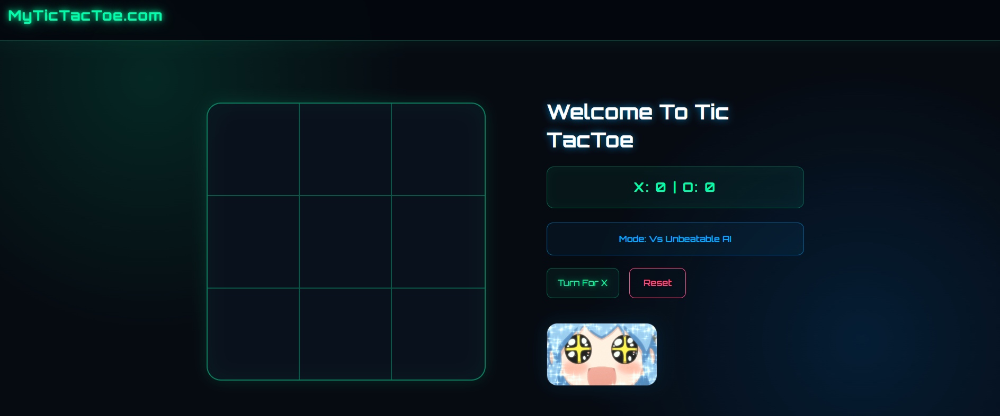

# 🎮 MyTicTacToe.com

A modern, responsive, and interactive Tic-Tac-Toe game built with HTML, CSS, and JavaScript.

The project combines classic Tic-Tac-Toe gameplay with a futuristic gaming-inspired interface and an **Unbeatable AI** mode.

## 🚀 Live Demo

🔗 **Live Demo:** [https://muhammadahmad152.github.io/tic-tac-toe-game/]

## 📸 Preview



## ✨ Features

- 🎮 Interactive Tic-Tac-Toe gameplay
- 🤖 Unbeatable AI mode
- ❌⭕ X and O player system
- 📊 Score tracking
- 🔄 Reset game functionality
- 🏆 Win detection
- 🤝 Draw detection
- 📱 Responsive design
- 🌌 Futuristic gaming-inspired UI
- ⚡ Dynamic game-state handling
- 🖥️ Desktop and mobile-friendly layout

## 🛠️ Technologies Used

- HTML5
- CSS3
- JavaScript (ES6+)

## 🧠 What I Learned

While building this project, I practiced and improved my understanding of:

- DOM manipulation
- JavaScript event handling
- Conditional logic
- Functions and reusable logic
- Game-state management
- Win and draw detection
- AI decision-making logic
- Score management
- Responsive web design
- UI/UX implementation

## 📂 Project Structure

```text
tic-tac-toe-game/
│
├── index.html
├── style.css
├── script.js
├── screenshot.png
└── README.md

🎯 Game Modes
🤖 Unbeatable AI

The game includes an AI opponent designed to provide a challenging gameplay experience.

👤 Player Mode

Players can interact with the game board, take turns, and track their scores.

📱 Responsive Design

The interface is designed to work across different screen sizes, including:

💻 Desktop
📱 Mobile
📟 Tablet
🔄 Future Improvements

Possible future improvements include:

🏆 Game statistics
🎚️ Difficulty levels
🔊 Sound effects
🎨 Additional themes
🥇 Leaderboard system
🌐 Online multiplayer
👨‍💻 Author

Muhammad Ahmad Khan

Aspiring Software Engineer | Full-Stack Developer

🔗 GitHub: muhammadahmad152

📄 License

This project is created for learning and portfolio purposes.
